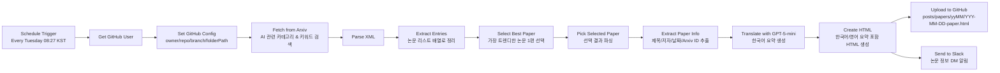
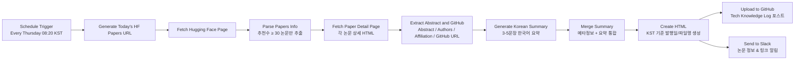
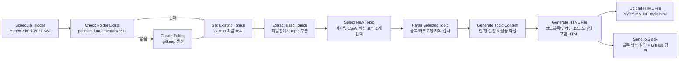

# Tech Knowledge Log

**Schedule:** Mon/Wed/Fri (Fundamentals) | Tue/Thu (Papers)

## Quick Start

```bash
# 1. Clone and setup
git init
git remote add origin https://github.com/YOUR_USERNAME/tech-knowledge-log.git
git push -u origin main

# 2. Enable GitHub Pages
# Settings → Pages → Source: main branch, / (root)

# 3. Import n8n workflow
# Upload: tech-knowledge-log-workflow.json
# Configure: Claude API, GitHub Token, Slack Webhook
```
- Arxiv Paper Workflow

- HuggingFace Paper Workflow

CS Knowledge Workflow

